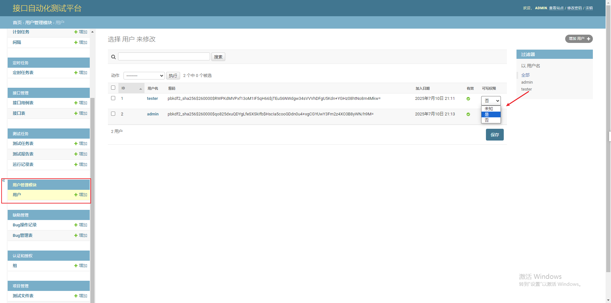

#  InterfaceTestPlatform--接口自动化测试平台（ITP）

## 介绍
InterfaceTestPlatform（简称 ITP）是一个基于 Django + Vue3 构建的自动化测试平台，专为现代测试团队设计，支持接口测试、场景测试、定时任务、权限管理等核心功能，提供可视化操作界面和完整的测试生命周期管理，让测试更高效、更智能、更协作。
支持接口测试、场景测试、定时任务等功能。

## 国产原创，自主可控
首个纯血国产自动化测试平台   
✅ 零依赖国外测试引擎（如 JMeter、Postman 等）     
✅ 全栈自主研发，100% 国产技术栈     
✅ 拒绝"换皮"，真正从零开始构建

🔹 纯血国产 - 不依赖任何国外开源测试框架  
🔹 自主创新 - 基于 Django + Vue3 全新架构设计    
🔹 安全可控 - 私有化部署，数据完全自主掌控     
🔹 生态完整 - 接口测试 + 场景编排 + 定时任务一体化  

告别"进口组装"，拥抱真正国产 

ITP - 让中国测试平台走向世界舞台！

## 核心功能
🧪 接口测试
可视化接口调试：像 Postman 一样直观，支持 GET、POST、PUT、DELETE 等多种请求方式。
参数化测试：支持动态参数、环境变量、全局变量，提升接口测试灵活性。
断言与响应验证：支持多种断言方式，自动验证接口响应结果。
历史记录与版本管理：接口调试记录自动保存，便于追溯与复用。   

🔄 场景测试（业务流测试）
多接口串联测试：将多个接口按顺序组合成业务流，模拟真实业务场景。
前置/后置脚本支持：使用 python 脚本进行数据处理与变量提取。

⏰ 定时任务
周期性任务调度：支持基于时间的定时执行任务，自动化运行测试用例。
任务日志追踪：完整记录任务执行过程，便于问题追踪与分析。    

🔐 权限管理
基于角色的权限控制（RBAC）：支持管理员、开发者、测试员等多角色权限配置。
可读/可写权限分离：细粒度控制用户操作权限，保障数据安全。
Django Admin 管理后台：便捷管理用户、权限、数据等。    

📊 可视化报告
实时测试报告：测试执行后自动生成可视化报告，支持 HTML等格式。
趋势分析图表：展示测试通过率、执行时长等关键指标趋势。 

📦 容器化部署
一键部署：基于 Docker 和 Docker Compose，支持快速部署到任意环境。
多环境适配：支持 CentOS 等主流操作系统。
镜像管理：支持私有仓库镜像推送与拉取，便于团队协作与版本控制。

## 体验网址
| 服务 | 地址        | 用途 | 用户名（密码） |
|--------|-----------|--------|--------|
| `前端访问` | http://1.95.215.79:18899/      | `浏览器访问` |`tester(88888888)` |
| `Admin 页面` | http://1.95.215.79:18899/admin      | `Django 后台管理界面` |`admin(88888888)` |
| `Swagger 文档` | http://1.95.215.79:18899/swagger      | `启用了 drf-yasg2` | |

## 软件架构
软件架构说明  

### 前端技术栈
- Vue3 + vite: 高性能前端框架，极速构建。
- Axios: 统一接口请求封装。
- Pinia: 轻量级状态管理工具
- Element Plus: 企业级 UI 组件库。
- ECharts + Canvas: 数据可视化展示。

### 后端技术栈
- Django + DRF（Django REST Framework）：高效构建 RESTful API。
- JWT 认证机制：安全的用户认证与权限管理。
- Celery + Redis：异步任务调度与任务队列管理。
- MySQL：稳定可靠的数据库支持。
- Django Filters：强大的接口过滤与排序能力。

### 容器化
- Docker + Docker Compose（v3.8）：支持一键部署、服务编排。
- Nginx + Gunicorn：高性能 Web 服务反向代理与负载均衡。
- 日志集中管理：日志统一输出至日志目录，便于监控与分析。
  
## 项目结构（研发）
interface-test-platform/                   
├── .env # 环境变量配置（部署时使用）    
├── docker-compose-remote.yaml # Docker 编排文件   
├── ITP/ # Django 后端项目目录    
├── front_end_pc/ # Vue 前端项目目录      
├── logs/ # 日志目录        
└── README.md # 项目说明文档

## 🌍 适用人群    

- 测试工程师：快速构建自动化测试用例，提升测试效率。
- 开发人员：验证接口稳定性，提前发现接口问题。
- 运维人员：自动化任务调度与监控，提升部署效率。
- 中小团队/企业：低成本构建企业级自动化测试平台，提升产品质量。

## 🌟 为什么选择 ITP？
| 特性        | 说明                              | 
|-----------|---------------------------------|
| `开箱即用`    | 提供完整的部署脚本与文档，30 分钟内完成部署。        | 
| `可视化操作`   | 无需编写代码即可完成接口测试与场景编排。            |
| `自动代码补齐`  | 编写前置脚本等可以自动补齐代码                 |
| `文件管理系统`  | 支持上传多种类型的测试附件，例如图片，excel等。      |
| `灵活可扩展`   | 支持插件化开发，满足个性化需求。                |
| `可视化报告`   | HTML 格式报告，支持趋势分析图表。             |
| `数据大屏监控`  | 提供大数据可视化平台。                     |
| `环境管理`    | 一套测试代码适配多套环境，支持测试环境，预发布环境，生产环境。 |
| `容器化部署`   | 支持一键部署，适配多种操作系统。                |
| `企业级权限控制` | 支持角色权限、可写权限、数据隔离。               |
| `社区与支持`   | 提供详细的文档、部署指南与开发者支持。             |

## 📣 与 Postman 的对比优势
| 功能        | ITP                     | Postman           |
|-----------|-------------------------|-------------------|
| `中文交互`    | ✅ 简单易懂（完整中文界面和文档）                | `❌ 不支持中文`         |
| `可视化接口测试` | ✅ 支持图形化界面操作             | `✅ 支持`            |
| `自动化测试`   | ✅ 支持接口/场景/定时任务          | `✅ 支持`            |
| `本地部署`    | ✅ 支持私有化部署               | `❌ 云端为主，私有化需付费`   |
| `团队协作`    | ✅ 支持多用户、权限管理            | `✅ 支持（需 Pro 账户）`  |
| `数据安全性`   | ✅ 私有部署，数据本地存储           | `❌ 云端存储，依赖第三方安全`  |
| `二次开发能力`  | ✅ 支持通过 API 和插件扩展；支持定制开发 | `❌ 依赖 Postman 平台` |
| `成本`      | ✅ 免费                    | `❌ 高级功能需订阅付费`     | 

📌 ITP 的优势在于：免费、可控、可定制、可私有化部署，是企业内部自动化测试的理想选择。

## 📈 应用场景
- 企业内部测试平台：构建企业专属的自动化测试平台，支持多团队协作。
- 持续集成/持续交付（CI/CD）：实现自动化回归测试。
- 教学与培训：作为自动化测试教学平台，帮助学员快速掌握测试技能。
- 商业部署：提供私有化部署服务，保障数据安全与合规性。

## 📈 未来展望
- ✅ 支持接口 Mock 服务
- ✅ 集成 Swagger / deepseek 接口自动导入
- ✅ 支持 AI 辅助测试（如接口智能预测、异常检测）

## 📢 加入我们
欢迎测试爱好者、开发者、运维人员加入 ITP 社区，一起打造企业级自动化测试平台。 你可以：
- 提交 Issue：报告问题、建议、bug 等。
- 编写文档与教程
- 参与产品设计与功能优化

# 立即开始
## 环境准备
- 操作系统：CentOS 7+ （已验证）Linux（如 Ubuntu、Debian、CentOS）、macOS、Windows（未验证）
- Docker 版本：>= 20.10
- Docker Compose 版本：== v3.8
- 防火墙配置，开放端口：18899（前端服务）、3308（MySQL）、8898（Django 后端服务）、6380（Redis）

## 环境配置
修改 .env 文件（可选），并添加以下内容：
支持的环境变量如下：

| 变量名 | 说明        | 默认值 |
|--------|-----------|--------|
| `IMAGE_TAG` | 镜像标签      | `latest` |
| `REGISTRY` | 共有仓库地址    | `crpi-ncj9jrb3jfedicto.cn-hangzhou.personal.cr.aliyuncs.com/autoplatform` |
| `FRONTEND_IMAGE` | 前端镜像名     | `${REGISTRY}/itp-frontend` |
| `DJANGO_IMAGE` | 后端镜像名     | `${REGISTRY}/itp-django` |
| `CELERY_WORKER_IMAGE` | Celery Worker 镜像名 | `${REGISTRY}/itp-celery-worker` |
| `CELERY_BEAT_IMAGE` | Celery Beat 镜像名 | `${REGISTRY}/itp-celery-beat` |
| `MYSQL_ROOT_PASSWORD` | MySQL 数据库密码 | `test1234` |
| `MYSQL_DATABASE` | 数据库名      | `itp` |
| `MYSQL_PORT` | MySQL 映射端口 | `3308` |
| `REDIS_PORT` | Redis 映射端口 | `6380` |
| `LOGS_DIR` | 日志目录      | `./logs` |
| `STATIC_DATA` | 静态文件卷     | `static-data` |
| `MEDIA_DATA` | 媒体文件卷     | `media-data` |
| `FIRST_DEPLOY` | 首次部署标记 | `true` |
| `VITE_API_BASE_URL` | 用于配置 API 请求的基础 URL | `http://1.95.215.79:8898` |

注意：部署前需配置 .env 文件，并修改相关参数，建议修改密码。

## 🐳 部署说明
#### 项目部署的文件结构
    itp/
    ├── docker-compose-remote.yaml  # 修改后的版本
    ├── .env
    ├── logs/
    ├── static-data/
    ├── media-data/
    └── README.md

### 1. 安装 Docker 和 Docker Compose

确保你已安装 [Docker](https://docs.docker.com/get-docker/) 和 [Docker Compose](https://docs.docker.com/compose/install/)

### 2. 启动服务
#### 建议在opt目录下创建项目
    拉取安装包
    git clone https://gitee.com/hp631012651/itp.git
#### 创建目录
    #进入项目目录
    cd itp
    # 创建日志目录及其子目录
    mkdir -p logs/nginx

    # 创建数据目录（虽然 Docker 会自动创建，但手动创建更清晰）
    mkdir -p static-data
    mkdir -p media-data

    # 进入项目目录
    cd /opt/itp
    
    # 检查当前权限
    ls -la
    
    # 设置目录权限
    chmod 755 logs
    chmod 777 logs/nginx
    chmod 777 static-data
    chmod 777 media-data
    
    # 验证权限设置
    ls -la

bash（阿里镜像仓库--推荐）

    docker-compose -f docker-compose-remote.yaml up -d

备选方案（华为云镜像仓库）   

    如果使用华为云镜像仓库，需要修改.env：
    # 修改为华为云仓库地址
    REGISTRY=swr.cn-north-4.myhuaweicloud.com/autoplatform
    # 然后再启动服务
    docker-compose -f docker-compose-huawei.yaml up -d

### 3. 查看日志
    bash(阿里镜像仓库--推荐）)    
    docker-compose -f docker-compose-remote.yaml logs -f  

备选方案（华为云镜像仓库） 
    
    docker-compose -f docker-compose-huawei.yaml ps  
    
    docker-compose -f docker-compose-huawei.yaml logs -f
   
### 4. 访问系统

http://your-server-ip:18899 

注册账号，登录即可使用系统。（注意新注册的账号只有可读权限，需要后台开通可写权限）   

例如：
http://1.95.215.79:18899/

swagger访问地址：
http://your-server-ip:8898/swagger 

### 5. 客户使用建议
账号管理    
建议创建一个管理员账号和多个测试账号
推荐使用 Django Admin 后台管理用户    
docker exec -it itp-django-end /envs/dj/bin/python manage.py createsuperuser                                            
访问地址：http://your-server-ip:18899/admin
开通可写权限，如图：

### 5.1 数据备份
数据备份    

数据库：使用 mysqldump 定期备份   

静态资源：备份 static-data 和 media-data    

日志：备份 logs/ 目录

### 5.2 日志查看

查看所有服务日志    

    docker-compose -f docker-compose-remote.yaml logs -f

查看后端日志    

    docker-compose -f docker-compose-remote.yaml logs django-app

查看前端日志  

    docker-compose -f docker-compose-remote.yaml logs vuefront

### 5.3 镜像更新    

拉取最新镜像  

    docker-compose -f docker-compose-remote.yaml pull

重启服务    

    docker-compose -f docker-compose-remote.yaml up -d

### 5.4 操作说明
请登录系统查看系统设置-操作说明

# FAQ:
1.Request URL: http://your-server-ip:18899/testproject/api/testpro/projects/   
  Request Method: GET     
  Status Code: 507 Insufficient Storage 

解决方法：   
 
     # 进入 Django 容器  
    docker exec -it itp-django-end bash 

    # 查看所有应用的迁移状态
    python manage.py showmigrations  

  一共有30张表；auth_group,auth_group_permissions,auth_permission,bughandle,bugmanage,cronjob,django_admin_log,django_celery_beat_clockedschedule,django_celery_beat_crontabschedule,django_celery_beat_intervalschedule,django_celery_beat_periodictask,django_celery_beat_periodicttasks,django_celery_beat_solarschedule,django_content_type,django_migrations,django_migrations,django_sesseion,interface,interfacecases,scenetocase,tb_users,tb_users_groups,tb_users_user_permissions,testenv,testfile,testproject,testrecord,testreport,testscenes,testtask,testtask_scene

    # 进入 Django 容器
    docker exec -it itp-django-end bash
    
    # 激活 Python 环境
    . /envs/dj/bin/activate
    
    # 进入项目目录
    cd /data/ITP

    # 生成所有应用的迁移文件
     python manage.py makemigrations Testproject  
  
     python manage.py makemigrations TestInterface    
  
     python manage.py makemigrations scenes   
  
     python manage.py makemigrations TestTask 
  
     python manage.py makemigrations Cronjob                                          
  
     python manage.py makemigrations BugManage
     
     python manage.py migrate
  

2.手动创建管理员账号   

    # 进入 Django 容器
    docker exec -it itp-django-end bash   

    # 激活虚拟环境
    . /envs/dj/bin/activate
    
    # 进入项目目录
    cd /data/ITP
    
    # 创建超级用户
    python manage.py createsuperuser --noinput
  
3.如何进入mysql容器内部操作？  

    # 进入 MySQL 容器
    docker exec -it itp-mysql bash
    
    # 连接 MySQL 数据库
    mysql -u root -p
    # 输入密码: test1234
    
    # 或者直接连接指定数据库
    mysql -u root -p itp
    # 输入密码: test1234

## 📞 联系

如有问题，请联系项目维护者。维护者：胡鹏；QQ：631012651;

